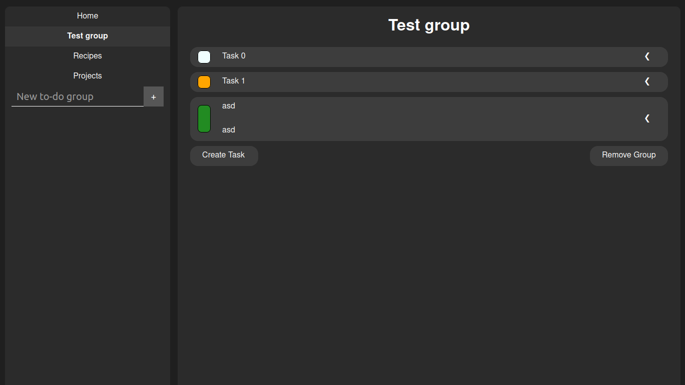

# Home Page

### Welcome to my very minimalistic-looking little project called "Todo App".

Live Demo: https://bernhart-todo-app.netlify.app/

In this project, you can create TodoGroups where you can put your tasks, but you can use it as a note app too, where you just put your notes.  
(I use it to store my cooking recipes too 😁)

In the next few points, I will explain how this app works.

### Basics

- There are 2 main sides of the page: the Navbar and the Main area.
- Your data (todoGroups, and the tasks) are saved in the localStorage, so if you download the source code you can use this app offline too.
- So if you have data, it will load automatically. If you don't have any, then it will load the default data. (with 1 example todoGroup)

### Navbar

- On the Navbar, there is the Home button and below it, you can see your TodoGroups.
- Below the list, there is a todoGroup creator form. You can use it if you want to create one.  
  (limit: 15)

### Main area

- In the main area, you can view the pages. (Home, tasks of the TodoGroups, and the error page)
- Below the title, you can see the list of the Tasks of the TodoGroup.
- Below that you can see 2 buttons, the create Task and the Remove group. I think this part is obvious.
- The limit for the Tasks is 20\. (I try to limit these, because of the localStorage)

### Tasks

- A task has 3 main properties: Status, title, and description.
- The status (the box on the right side of the title) has 3 colors. (gray = not started, orange = in progress, green = done)
- You can click on the status (on focus just press enter) to switch between these statuses.
- If you click on the title-bar, the description will be toggled.
- Under that, there are 4 buttons, which you can control the task. (on focus, you can use arrow buttons)

### GOOD TO KNOW

- There are limits on how many lines you can write in a task.
- Title: 5 lines
- Description: 10 lines

### Features

- On PC you can use this app with a keyboard  
  (tab = next, shift+tab = previous, enter = apply or use, escape = leave or cancel)

### Never tested features

- I store these data in the localStorage and I know that it has a limit. but I have never tested that. By the way, this is the reason I made the limits, but I have zero idea if they are good or not for the localStorage.
- Try not to exceed it 😛
